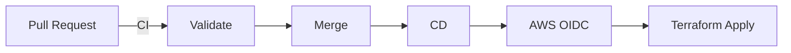

<div style="background-color:#0a0a23; color:white; padding:25px; border-radius:12px; text-align:center;">
  <h1 style="color:#ff6600;">DigiFusion – CI/CD & Terraform</h1>
  <p style="font-size:18px; color:#cccccc;">Portfólio profissional com padrões FAANG</p>
</div>

---

## 🌟 Status do Projeto


---

## 🌐 Visão Geral

> 🚀 Pipeline CI/CD com Terraform + AWS + GitHub Actions  
> 🔐 Segurança via OIDC (sem credenciais hardcoded)  
> 📦 Infraestrutura como código (IaC)

---

## 🏗️ Arquitetura



---

## 📂 Detalhamento Técnico

<details>
<summary><strong>🔧 Pipeline CI</strong></summary>

- terraform fmt  
- terraform validate  
- terraform plan  
- Executado em Pull Requests  

</details>

---

<details>
<summary><strong>🚀 Pipeline CD</strong></summary>

- Trigger: push na main  
- Autenticação: AWS OIDC  
- Deploy automático com terraform apply  

</details>

---

<details>
<summary><strong>🔐 Segurança (OIDC)</strong></summary>

- Sem uso de Access Key  
- Autenticação via GitHub → AWS  
- Role com trust policy OIDC  
- Princípio de menor privilégio  

</details>

---

<details>
<summary><strong>🏗️ Infraestrutura Terraform</strong></summary>

- VPC  
- Subnets  
- Security Groups  
- RDS  
- S3  

</details>

---

## 📌 Skills Demonstradas

<div style="display:grid; grid-template-columns: repeat(2, 1fr); gap:10px;">

<div style="background:#1a1a40; padding:10px; border-radius:6px;">Terraform Modular</div>
<div style="background:#1a1a40; padding:10px; border-radius:6px;">CI/CD</div>
<div style="background:#1a1a40; padding:10px; border-radius:6px;">AWS OIDC</div>
<div style="background:#1a1a40; padding:10px; border-radius:6px;">Git Flow</div>

</div>

---

## 🚀 Roadmap

<details>
<summary><strong>📈 Expansão futura</strong></summary>

- Ambiente PROD com approval  
- Integração com n8n  
- Observabilidade (logs + metrics)  
- Backup automatizado  

</details>

---

## ▶️ Execução Local

```bash
git clone https://github.com/apduartte/DigiFusion.git
cd DigiFusion/bia/infra/terraform

terraform init
terraform validate
terraform plan
terraform apply -auto-approve
```

---

## ⚠️ Observação

<div style="background-color:#ff6600; color:white; padding:10px; border-radius:6px;">
Certifique-se de configurar corretamente o environment <strong>dev</strong> e os secrets AWS no GitHub.
</div>

---

<div style="text-align:center; margin-top:20px;">
  <strong>💻 DigiFusion | Portfólio Profissional</strong>
</div>