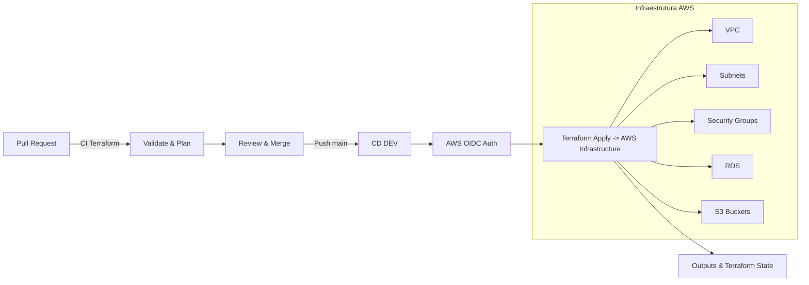

<div style="background-color:#0a0a23; color:white; padding:25px; border-radius:12px; text-align:center;">
  <h1 style="color:#ff6600; margin-bottom:5px;">DigiFusion – CI/CD & Terraform</h1>
  </div>

---

## 🌟 Status do Projeto

<div style="display:flex; gap:10px; flex-wrap:wrap;">


</div>

---

## 🌐 Visão Geral

<div style="background-color:#1a1a40; color:white; padding:15px; border-radius:8px;">
DigiFusion combina **Terraform**, **AWS** e **GitHub Actions** para criar pipelines CI/CD **seguros, escaláveis e fáceis de auditar**.  
O projeto demonstra **controle de ambientes, automação e boas práticas de engenharia.
</div>

---

## 🏗️ Arquitetura do Pipeline



---

### 📌 Skills Demonstradas

- **Terraform modular** (VPC, RDS, S3, Security Groups)  
- **CI/CD** com GitHub Actions  
- **OIDC AWS** para autenticação segura  
- **Git Flow** para versionamento e branch strategy  
- Automação de deploy DEV e PROD  
- Boas práticas de documentação e portfólio técnico  

---

### 📌 Próximos Passos / Expansão

<div style="background-color:#ff6600; color:white; padding:10px; border-radius:6px;">
- Criar ambiente **PROD** com workflow de deploy e **approval**
- Integração com **n8n** para automações de negócios
- Pipeline de **snapshot de dados / logs / backups**
- Visualização de **state Terraform** e outputs via dashboard
</div>

---

### 📌 Como Usar

1. Clone o repositório:

```bash
git clone https://github.com/apduartte/DigiFusion.git
```

2. Acesse a pasta Terraform:

```bash
cd DigiFusion/bia/infra/terraform
```

3. Inicialize Terraform:

```bash
terraform init
```

4. Valide e aplique o plano:

```bash
terraform validate
terraform plan
terraform apply -auto-approve
```

---

💡 **Observação**: Para o pipeline DEV funcionar, certifique-se de que **GitHub Actions** está configurado com `environment: dev` e **secrets AWS** configurados corretamente.

---

<div style="background-color:#0a0a23; color:#ff6600; padding:15px; border-radius:8px; text-align:center;">
<h2>💻 Publicação</h2>
<p style="color:white;">Use a branch <strong>main</strong> ou <strong>gh-pages</strong> para GitHub Pages.</p>
</div>
