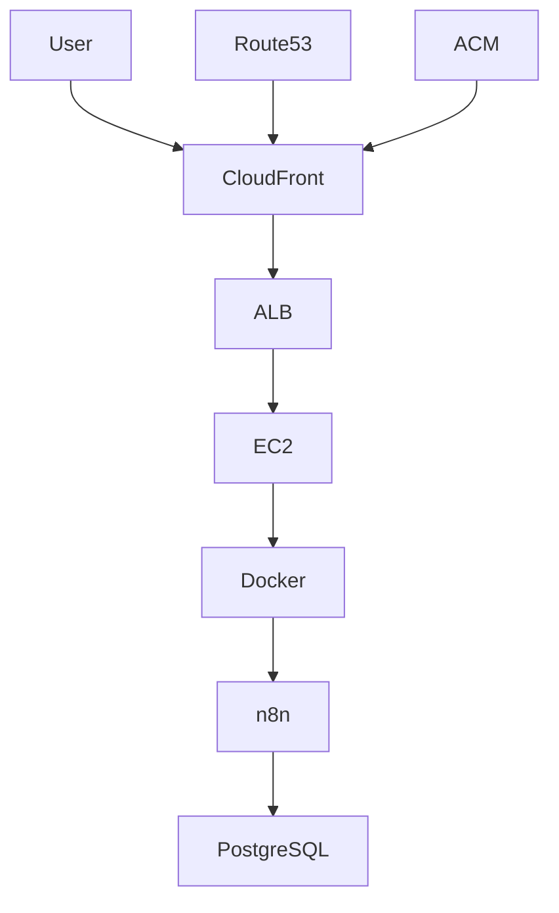

# 🚀 POC – n8n na AWS com Terraform


---
# 🚀 n8n on AWS | Cloud Architecture | Terraform | HTTPS | DevOps Project

<p align="center">
  
  
  
  
  
</p>

---

## 📌 Overview

This project demonstrates a **cloud-native architecture on AWS** evolving from a **Single Instance deployment** to a **scalable, secure, and production-ready architecture**.

It highlights:

* Infrastructure as Code (Terraform)
* Secure delivery with HTTPS (ACM)
* Global content distribution (CloudFront)
* DNS management (Route53)
* DevOps and FinOps best practices

---

## 🏗️ AWS Architecture (Professional View)



---

### 🔎 Architecture Explanation

| Layer     | Service    | Responsibility          |
| --------- | ---------- | ----------------------- |
| Edge      | CloudFront | CDN + HTTPS termination |
| DNS       | Route53    | Domain routing          |
| Security  | ACM        | SSL/TLS certificate     |
| Compute   | EC2        | Application host        |
| Container | Docker     | Runtime                 |
| App       | n8n        | Automation workflows    |
| Data      | PostgreSQL | Persistence             |

---

## 🔐 HTTPS + CDN (CloudFront + ACM)

### 🎯 Objective

Deliver the application securely using HTTPS and globally optimized performance.

### 📌 Key Decisions

* ACM certificate MUST be in `us-east-1` (CloudFront requirement)
* CloudFront used as entry point (edge layer)
* Route53 manages domain resolution

---

## ⚙️ Terraform (CloudFront + ACM + Route53)

### 📁 Example Structure

```
terraform/
 ├── modules/
 │    ├── acm/
 │    ├── cloudfront/
 │    └── route53/
 └── environments/
      └── dev/
```

---

### 🧩 ACM (SSL Certificate)

```hcl
resource "aws_acm_certificate" "cert" {
  domain_name       = "n8n.seudominio.com"
  validation_method = "DNS"

  lifecycle {
    create_before_destroy = true
  }
}
```

---

### 🌍 Route53 (DNS Validation)

```hcl
resource "aws_route53_record" "cert_validation" {
  zone_id = "ZXXXXXXXX"
  name    = aws_acm_certificate.cert.domain_validation_options[0].resource_record_name
  type    = aws_acm_certificate.cert.domain_validation_options[0].resource_record_type
  records = [aws_acm_certificate.cert.domain_validation_options[0].resource_record_value]
  ttl     = 60
}
```

---

### 🚀 CloudFront (CDN + HTTPS)

```hcl
resource "aws_cloudfront_distribution" "cdn" {
  enabled = true

  origin {
    domain_name = "seu-alb.amazonaws.com"
    origin_id   = "alb-origin"
  }

  default_cache_behavior {
    target_origin_id       = "alb-origin"
    viewer_protocol_policy = "redirect-to-https"
  }

  viewer_certificate {
    acm_certificate_arn = aws_acm_certificate.cert.arn
    ssl_support_method  = "sni-only"
  }
}
```

---

## ⚖️ Arquitetura Comparativa (Para Apresentação)

### 🔹 Modelo do colega (Simples)

```
Internet → EC2 → Docker → n8n
```

**Características:**

* Simples
* Rápido de implementar
* Sem HTTPS nativo
* Sem alta disponibilidade
* Sem CDN

---

### 🔹 Sua Arquitetura (Evoluída)

```
User → Route53 → CloudFront → ALB → EC2 → Docker → n8n → DB
```

**Diferenciais técnicos:**

✔ HTTPS com certificado gerenciado
✔ CDN global (baixa latência)
✔ Separação de camadas
✔ Preparado para escalar
✔ Melhor prática AWS

---

### 🧠 Como explicar isso na apresentação

> “A proposta evolui de uma arquitetura funcional para uma arquitetura orientada a produção, incorporando segurança (HTTPS), distribuição global (CDN) e desacoplamento de camadas, permitindo escalabilidade e maior resiliência.”

---

## 📈 Escalabilidade

| Componente | Evolução     |
| ---------- | ------------ |
| EC2        | Auto Scaling |
| ALB        | Multi-AZ     |
| n8n        | Queue Mode   |
| DB         | RDS          |

---

## 🔐 Segurança

* HTTPS obrigatório (CloudFront + ACM)
* Security Groups restritivos
* Possibilidade de WAF
* Isolamento por camadas

---

## 💰 FinOps

| Recurso    | Estratégia           |
| ---------- | -------------------- |
| EC2        | t3.micro (Free Tier) |
| CloudFront | Pay-per-use          |
| Route53    | baixo custo          |
| ACM        | gratuito             |

💡 Arquitetura pensada para crescer **sem custo inicial alto**.

---

## 🧪 Testes (Postman)

Fluxo:

1. Criar webhook no n8n
2. Expor via HTTPS (CloudFront)
3. Testar com Postman
4. Validar execução

---

## 🚀 Roadmap

* [ ] Terraform completo modular
* [ ] Multi-environment (dev/staging/prod)
* [ ] Observabilidade (CloudWatch)
* [ ] CI/CD pipeline
* [ ] Arquitetura distribuída (SQS + workers)

---

## 🎯 Conclusão

Este projeto demonstra:

* Evolução de arquitetura (simples → escalável)
* Uso de boas práticas AWS
* Segurança desde o início
* Pensamento de engenharia de produção

💡 Mais do que rodar uma aplicação, o foco foi construir uma **base sólida para sistemas reais em nuvem**.
